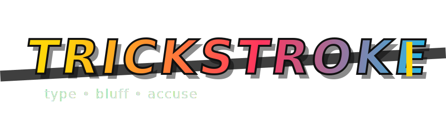

<div align="center">



**A real-time multiplayer social deduction word game where creativity meets deception.**

[](https://reactjs.org/)
[](https://nodejs.org/)
[](https://socket.io/)
[](https://vitejs.dev/)

</div>

---

## 🎮 How to Play

### 1. **Join a Lobby**
   - Up to **8 players** can join a game
   - One player becomes the **Host** who controls game settings

### 2. **Roles**
   - **🎨 Artists**: Receive a **Secret Word** and must create words related to it
   - **🎭 Trickster**: Does **NOT** see the word. Their goal is to blend in and avoid detection

### 3. **The Game**
   - Players take turns submitting **one word** related to the Secret Word
   - **Trickster Twist**: If the Trickster goes first, they get a list of options to help them bluff
   - **No Repeats**: You cannot use the Secret Word or any word already submitted

### 4. **Discussion & Voting**
   - After everyone submits, discuss and vote on who you think the Trickster is
   - Use the chat to strategize and accuse

### 5. **Winning**
   - **🎨 Artists Win**: If they successfully vote out the Trickster
   - **🎭 Trickster Wins**: If they survive the vote (or if the vote is a tie after Max Rounds)

---

## 🛠 Tech Stack

| Category | Technology |
|----------|-----------|
| **Frontend** | React 18.2.0 (Vite) |
| **Backend** | Node.js (Express) |
| **Real-time** | Socket.IO 4.7.2 |
| **Styling** | Custom CSS (Outfit font, Neon/Pop aesthetic) |
| **Build Tool** | Vite 5.0.8 |

---

## 🚀 Quick Start

### Prerequisites
- **Node.js** (v16 or higher recommended)
- **npm** or **yarn**

### Installation & Setup

#### 1. Clone the Repository
```bash
git clone https://github.com/heysuhas/trickstroke.git
cd trickstroke
```

#### 2. Start the Server
```bash
cd server
npm install
npm run dev
```
🌐 Server runs on `http://localhost:3000`

#### 3. Start the Client
```bash
cd client
npm install
npm run dev
```
🌐 Client runs on `http://localhost:5173`

---

## 🎨 Features

### ✨ **Dynamic UI**
- **Glassmorphism** design with neon accents
- Smooth animations and transitions
- Modern, eye-catching aesthetic

### ⚙️ **Host Configuration**
- Customize number of rounds (1-5)
- Adjust turn time (10-60 seconds)
- Set discussion time (30-120 seconds)

### 📱 **Responsive Design**
- Works seamlessly on desktop and mobile devices
- Adaptive layout for all screen sizes

### 🧠 **Smart Game Logic**
- Prevents duplicate usernames
- Ensures unique secret words per session
- Real-time synchronization across all players

---

## 🌐 Deployment

### Frontend (Vercel)
The client is configured for easy deployment on Vercel. See `client/vercel.json` for configuration.

### Backend (Render/Railway)
The server is optimized for deployment on platforms that support WebSocket connections (Render, Railway, etc.).

---

## 📝 Project Structure

```
trickstroke/
├── client/                 # React frontend application
│   ├── src/
│   │   ├── components/     # React components
│   │   ├── App.jsx         # Main app component
│   │   └── socket.js       # Socket.IO client
│   └── package.json
├── server/                 # Node.js backend server
│   ├── src/
│   │   ├── Game.js         # Game logic
│   │   └── RoomManager.js  # Room management
│   └── package.json
└── README.md
```

---

## 🎯 Game Phases

1. **LOBBY** - Players join and host configures settings
2. **ROLE_ASSIGNMENT** - Roles are randomly assigned
3. **WORD_SELECTION** - Trickster selects word (if going first)
4. **DRAW_ORDER_ASSIGNMENT** - Turn order is determined
5. **WORD_SUBMISSION** - Players submit their words
6. **DISCUSSION** - Players chat and strategize
7. **VOTING** - Vote on who you think is the Trickster
8. **LEADERBOARD** - Round results and scores
9. **GAME_OVER** - Final results

---

## 🤝 Contributing

Contributions are welcome! Feel free to open an issue or submit a pull request.

---

## 📄 License

This project was created for the TrickStroke Game Development Project.

---

<div align="center">

**Made with ❤️ and lots of 🎭 deception**

*type • bluff • accuse*

</div>
